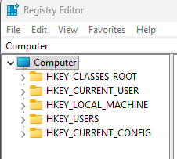

## Windows Artifacts 

There are many programs on Microsoft that provide a wealth of information to forensic analysts. These programs were not put by Microsoft to spy on you rather they are needed for other tasks. For instance, there are programs that help launch windows applications or programs that help with backwards compatibility. 

An important thing to grasp is these artifacts often change when there are newer operating system releases. 

### Windows Registry

This is a <b>central hierarchical database</b> used to store information that is necessary to configure the system for applications, hardware devices, or users. 

It holds configuration information that Windows actively references to operate the OS. Windows reads this registry constantly so it does not have to "guess" how everything should work. For example, it can include user settings (HKCU), System-wide settings (HKLM), what programs are installed, what file types open with what, hardware/driver configuration, startup/persistence settings (Run/RunOnce). 

 

### What are Registry Hives?  

A <b>Registry Hive</b> is a top-level folder that contain crucial configuration data, user profiles, and system settings. They form the backbone of the Windows Registry database. Everything under them are <b>Subkeys</b>, and under the Subkeys, there are <b>Values</b> that contain the actual data. There are 5 root registry hives that include: 

These can be found in the <b>Registry Editor</b> or the <b>Regedit</b> application in Windows. 

On Windows, we can also navigate to `%SystemRoot%\System32\config\`. It could be like `C:\Windows\System32\config` for example. 

- ### 1. HKEY_CURRENT_USER (HKCU)

    This registry stores settings specific to the user currently logged in. If you open CMD and type in the following: `dir/ah`, you would see a hive file called `NTUSER.DAT`. This file stores most of the user's registry data and so when the user logs in, Windows loads this file and maps it into the registry as that user's hive. Some information includes the users folders, screen colours, and control panel settings. 
    
    During an incident, looking at this file can give us information on a couple of actions that user performed such as: 

    - recently opened files 
    - commands used 
    - application usage 

    Usually when we talk about <b>HKEY_CURRENT_USER (HKCU)</b>, we are talking about the analysis of a <b>live system</b>. 
    
    When we talk about <b>NTUSER.DAT</b>, we are talking about parsing a file on a <b>dead system</b>. A dead system means the machine is powered off and you are analyzing a disk image/copied filed offline. In this case, it would be NTUSER.DAT. 

- ### 2. HKEY_LOCAL_MACHINE (HKLM)

    This registry stores system related/configuration settings for a particular computer which affects all the users. Whenever we forensicate a Windows system, there are VERY important hive files we want to look at in HKLM which are: 

    - `SAM` → This is the <b>Security Accounts Manager</b> database. It starts running in the background as soon as Windows boots up. It contains information about:

        - <b>Local username/account IDs</b> 
        - <b>Password Hashes</b>
        - <b>Account properties</b>
    
        It is mainly meant for authenticating local users in which it is the responsibility of <b>LSA (Local Security Authority)</b> to verify the user's login by matching passwords maintained in SAM. The database stores the password hashes using the <b>NTLM</b> format which is based on the <b>MD4</b> algorithm. Moreover, the NTLM hash is 16 bytes (128 bits) and is produced by hashing the password (encoded in UTF-16 Little Endian) using that MD4 algorithm.

        It is vulnerable and attackers can exploit it, but I will add on later ⚠️ "ADD LATER". 

    - `SECURITY` → This stores local security policies, user rights assignments, and Access Control Lists. Attackers often target this hive file to dump credentials or to understand security configurations. 
    - `SOFTWARE` → This contains information regarding configuration settings and data for installed application, services, and different windows components that apply globally to the machine. 
    - `SYSTEM` → This contains critical boot configuration, driver and system settings. 
    - `HARDWARE` → This is generated dynamically on system boot rather than Disk. Note that Disk is stuff saved as files which persists after shutdown. So even from a dead drive, you can grab SAM, SECURITY, SOFTWARE, SYSTEM hive files, but can't grab hardware. HARDWARE is created during boot and so to collect data of it, you need a live acquisition or it would have had to been exported beforehand. This is useful for <b>live</b> investigations.
        
        - It contains information Windows discovers while starting up such as detected devices, BIOS/UEFI, CPU identifiers, Resource mappings, etc... 

        - Simply put, it this is "at this moment, on this boot, this is the hardware Windows sees and how it is wired up". 
