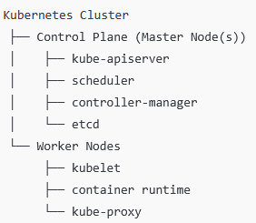

### What is Kubernetes?  

Kubernetes, also known as K8 is an open-source system for automating deployment, scaling, and management of containerized applications. We can imagine K8 as a conductor of an orchestra (containers). 

It is a client-server architecture which contains many different components that we will go through

### Kubernetes Components  

- <b>Kubernetes Cluster:</b> This is simply the entire environment which is coordinated by the control plane.

- <b>Worker Nodes:</b> These are VMs or physical machines that carry out all the work running your application or workloads. 

- <b>Pods:</b> Since Kubernetes does not run containers directly, it runs pods, and the pods run the containers. We can say "Pods are the smallest deployable unit in Kubernetes and are responsible for running containers on worker nodes". 

- <b>Control Plane (Master Node):</b> The control plane is the set of components that manage the health and orchestration of a cluster, and it runs on one or more master nodes. The control plane is the role/function while the master node is the machine(s) running that role. They are not different, just different ways of talking about the same responsibility. Note, that a <b>Node</b> can be a VM or physical machine. 

    1. <b>Kube-API Server:</b> This component exposes the Kubernetes API which is simply the front door of Kubernetes that coordinates and approves requests such as listening to queries and updates via CLI like Kubectl. No request is passed directly to the cluster, it must go through the API Server to validate the request. 

    2. <b>Kube-Scheduler:</b> 

